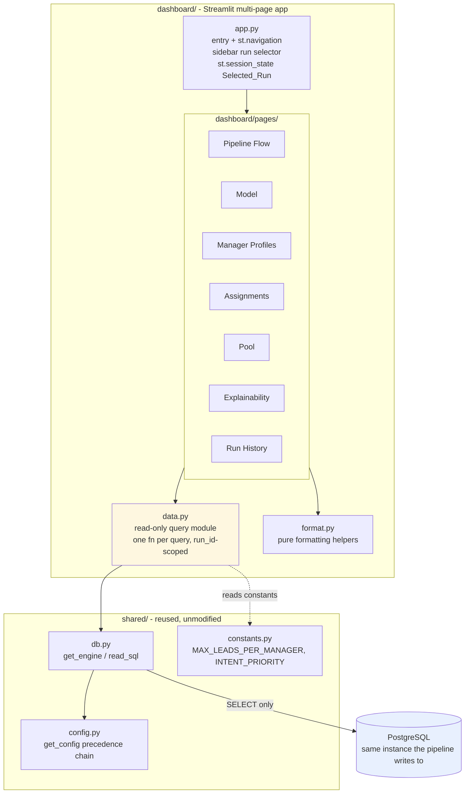
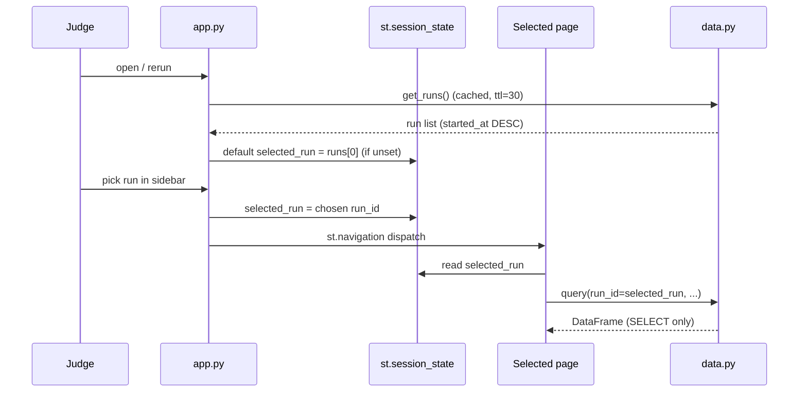

# Design Document

## Overview

The Streamlit Dashboard is a **read-only** visualization surface for the AI-Powered
Intelligent Lead Assignment Engine (Task 11 in `PLAN.md`). It is a Streamlit
multi-page app living in a new `dashboard/` package. It connects to the **same**
PostgreSQL database the nightly pipeline writes to, reusing the existing
`shared/config.py` resolution chain and the cached engine in `shared/db.py`. It
never writes, never issues DDL, and never triggers a pipeline stage.

Design pillars, each traceable to a requirement:

- **Read-only by construction.** The only DB entry point exposed to the pages is
  a data-access module (`dashboard/data.py`) whose every function is a
  parameterized `SELECT`. There is no write helper imported anywhere in
  `dashboard/`. (Req 1.1, 1.2)
- **Reuse the shared plumbing.** Connections come from `shared.db.get_engine` /
  `shared.db.read_sql`; configuration comes from `shared.config.get_config`.
  The dashboard constructs no engine of its own, so credentials resolve exactly
  as they do for the lambdas: Secrets Manager, then env vars, then local
  defaults. (Req 1.3, 2.1, 2.2)
- **Aggregate in SQL.** Every count, breakdown, and distribution is computed by
  a `GROUP BY` / aggregate query, not by pulling rows into pandas and counting.
  (Req 1.4, 11.4)
- **Anonymized agents.** Every view identifies an Agent by `manager_id` only.
  `manager_profiles.manager_name` exists in the DB (migration `003`) but is
  never selected, rendered, or logged. (Req 2.6, 2.7)
- **Bounded reads.** Per-pair tables (`scores`, `eligibility_matrix`) and large
  output tables (`assignments`, `pool`) are always paged with `LIMIT`/`OFFSET`;
  the full leads x managers cross-join is never materialized in Python.
  (Req 11.1, 11.2)

## Architecture



The pages depend only on `data.py` (for reads) and `format.py` (for display).
`data.py` is the single choke point that touches `shared.db`. Because pages
cannot reach the engine directly, the read-only guarantee is a structural
property, not a convention.

### Streamlit and multipage approach

`requirements-dev.txt` pins `streamlit==1.36.0` and `plotly==5.22.0`. Streamlit
`1.36.0` is the release that introduced the programmatic navigation API
(`st.Page` + `st.navigation`). We use that API rather than the older
auto-discovered `pages/` directory convention.

Justification:

- **Shared pre-page code.** With `st.navigation`, `app.py` runs on every
  rerun *before* the selected page renders. That is exactly where the run
  selector belongs: resolve the list of runs, default `Selected_Run` to the most
  recent, render the sidebar selector, and write it to `st.session_state` — then
  hand off to the page. The legacy `pages/` convention gives no shared
  pre-render hook, so the selector would have to be duplicated per page.
- **Ordering and labels.** `st.navigation` lets us order and title the seven
  views explicitly (Pipeline Flow first), instead of relying on filename
  prefixes.
- **Version fit.** The API is stable in `1.36.0`; no upgrade is required.

Tradeoff: the `pages/` directory convention is marginally simpler for a trivial
app, but it cannot host the shared run selector cleanly. We accept the small
extra wiring in `app.py` to keep run scoping in one place.

## Components and Interfaces

### Project Structure

```
dashboard/
  __init__.py
  app.py            # entry point: config/connection bootstrap, sidebar run
                    # selector, st.session_state["selected_run"], st.navigation
  data.py           # read-only query module: one function per query, all
                    # parameterized and run_id-scoped where applicable
  format.py         # pure formatting helpers (no Streamlit, no DB)
  pages/
    pipeline_flow.py     # Req 4
    model.py             # Req 5
    manager_profiles.py  # Req 6
    assignments.py       # Req 7
    pool.py              # Req 8
    explainability.py    # Req 9
    run_history.py       # Req 10
```

`app.py` responsibilities:

- Call a `data.py` connection-probe helper; on failure render the friendly
  non-secret message (host/port/dbname) and stop. (Req 2.3)
- Load the run list (short TTL), default `Selected_Run` to the most recent
  `started_at`, and render the sidebar `st.selectbox`. (Req 3.1, 3.2)
- Persist the choice in `st.session_state["selected_run"]` so every page reads
  the same run. (Req 3.3)
- Register the seven pages via `st.Page` and dispatch with `st.navigation`.
- Provide a global "Refresh cached data" button that calls
  `st.cache_data.clear()`. (Req 5.5, 6.6, 11.3)

`data.py` conventions:

- Every public function takes explicit params and calls
  `shared.db.read_sql(SQL, params)`.
- No function issues anything but `SELECT` (or `SELECT`-only CTEs). No `INSERT`,
  `UPDATE`, `DELETE`, or DDL exists in the module. (Req 1.1, 1.2)
- Slow-changing reads are decorated with `@st.cache_data(ttl=...)`; run-scoped
  reads are uncached or short-TTL.

`format.py` conventions:

- Pure functions only, unit-testable without Streamlit or a DB: probability and
  percent formatting with fixed precision, `"N/A"` for `None`/`NaN`, Postgres
  array (`text[]`) rendering, and confidence display.

### Data-Access Layer Design

All queries below are parameterized (`:name`) and executed through
`shared.db.read_sql`. Aggregation happens in SQL. Per-pair and large tables are
paged.

#### Cross-cutting SQL notes

**Lower-cased conv_rate columns.** `manager_profiles` declares `conv_rate_H`,
`conv_rate_M`, `conv_rate_L` unquoted, so Postgres folds them to
`conv_rate_h/_m/_l` and `SELECT *` returns the lower-cased names. The scoring
lambda already works around this in Python (`_restore_feature_case`). The
dashboard does the equivalent **in SQL** by aliasing the columns back to their
displayed spelling, so pandas receives the mixed-case names the view expects:

```sql
SELECT conv_rate_h AS "conv_rate_H",
       conv_rate_m AS "conv_rate_M",
       conv_rate_l AS "conv_rate_L"
```

**Anonymization.** No query in `data.py` selects `manager_name` from
`manager_profiles` or `lead_manager_history`. Agent identity is always
`manager_id`. (Req 2.6, 2.7)

**Paging.** `scores`, `eligibility_matrix`, `assignments`, and `pool` reads take
`:limit` and `:offset`; a companion `count(*)` query drives page navigation. The
full cross-join is never selected without a `WHERE run_id = :run_id AND
lead_id = :lead_id` (Explainability) or a `LIMIT` (list views). (Req 11.1, 11.2)

#### Run selection queries

Run list for the sidebar and Run History (Req 3.2, 10.1, 10.2):

```sql
SELECT run_id, started_at, completed_at, status, stage,
       leads_processed, leads_assigned, leads_pooled
FROM pipeline_runs
ORDER BY started_at DESC;
```

Default run = most recent `started_at` (Req 3.1) is the first row of the above,
so no separate query is needed; the app takes `run_list[0]` when
`st.session_state` has no selection yet. If the result is empty, the app renders
the "no runs available" Empty_State. (Req 3.4)

#### Pipeline Flow queries (Req 4)

Run header (Req 4.1, 4.2, 4.5):

```sql
SELECT run_id, status, stage, started_at, completed_at,
       leads_processed, leads_assigned, leads_pooled, errors
FROM pipeline_runs
WHERE run_id = :run_id;
```

Funnel reconciliation — valid leads = assigned + pooled, computed in SQL
(Req 4.3):

```sql
SELECT
    (SELECT count(*) FROM assignments WHERE run_id = :run_id) AS assigned,
    (SELECT count(*) FROM pool        WHERE run_id = :run_id) AS pooled,
    (SELECT count(*) FROM assignments WHERE run_id = :run_id)
      + (SELECT count(*) FROM pool    WHERE run_id = :run_id) AS reconciled_total;
```

The view compares `reconciled_total` against `pipeline_runs.leads_processed`
and shows the assigned/pooled split.

Pool breakdown by reason (Req 4.4):

```sql
SELECT reason, count(*) AS n
FROM pool
WHERE run_id = :run_id
GROUP BY reason;
```

The two expected reasons are `no_eligible_manager` and `capacity_overflow`
(from `lambdas/pool/handler.py`). Missing reasons render as `0`.

#### Model query (Req 5)

```sql
SELECT model_id, trained_at, auc, precision, recall, training_rows, feature_list
FROM model_registry
WHERE is_active;
```

Zero rows -> "no active model" Empty_State (Req 5.4). Null metrics -> `"N/A"`
via `format.py` (Req 5.2). This read is cached (Req 5.5). `feature_list` is
`JSONB` and is rendered as a list.

#### Manager Profiles queries (Req 6)

Profiles, conv_rate aliased, `manager_name` excluded (Req 6.1, 6.2, 6.3, 6.4):

```sql
SELECT manager_id,
       languages_handled,
       geographies_handled,
       products_handled,
       conv_rate_overall,
       conv_rate_h AS "conv_rate_H",
       conv_rate_m AS "conv_rate_M",
       conv_rate_l AS "conv_rate_L",
       avg_response_mins,
       total_leads_handled,
       last_active_date,
       derived_active_flag
FROM manager_profiles
ORDER BY manager_id;
```

`manager_profiles.manager_id` is the primary key, so the table is already one
row per Agent (Req 6.4 grouping is satisfied by the table grain). This read is
cached (Req 6.6). Zero rows -> Empty_State (Req 6.7).

Per-agent current-run assignment count and remaining capacity vs the 50 cap
(Req 6.5), aggregated in SQL:

```sql
SELECT mp.manager_id,
       COALESCE(a.assigned_count, 0)                       AS current_run_assignments,
       GREATEST(0, :cap - COALESCE(a.assigned_count, 0))   AS remaining_capacity
FROM manager_profiles mp
LEFT JOIN (
    SELECT primary_manager_id AS manager_id, count(*) AS assigned_count
    FROM assignments
    WHERE run_id = :run_id
    GROUP BY primary_manager_id
) a ON a.manager_id = mp.manager_id
ORDER BY mp.manager_id;
```

`:cap` is bound from `shared.constants.MAX_LEADS_PER_MANAGER` (50). This uses
the run's own assignment count as the "current-run" load, which is the natural
per-run reading of Req 6.5.

Note on `manager_daily_load`: migration `002` defines a `manager_daily_load`
view keyed by `business_date` that sums optimizer assignments *plus* pool
claims across all runs sharing that date. That view is the pipeline's capacity
authority. We deliberately show the **run-scoped** count in this view because
the dashboard is run-scoped and Req 6.5 asks for the current-run count; the
`manager_daily_load` view can be surfaced as a supplementary "business-date
load" figure if desired, but it is not the primary number to avoid conflating
multiple runs on one date. (Tradeoff noted for review.)

#### Assignments queries (Req 7)

Paged rows (Req 7.1, 7.5):

```sql
SELECT lead_id, primary_manager_id, fallback_manager_id,
       confidence_score, match_score, intent_bucket, assigned_at, push_status
FROM assignments
WHERE run_id = :run_id
ORDER BY lead_id
LIMIT :limit OFFSET :offset;
```

Page count driver:

```sql
SELECT count(*) AS n FROM assignments WHERE run_id = :run_id;
```

Push-status breakdown (Req 7.3):

```sql
SELECT push_status, count(*) AS n
FROM assignments
WHERE run_id = :run_id
GROUP BY push_status;
```

Agent-wise assignment distribution with cap flag (Req 7.4), aggregated in SQL:

```sql
SELECT primary_manager_id       AS manager_id,
       count(*)                 AS assignment_count,
       (count(*) = :cap)        AS at_cap
FROM assignments
WHERE run_id = :run_id
GROUP BY primary_manager_id
ORDER BY assignment_count DESC, manager_id;
```

Agents where `at_cap` is true (count = 50) are highlighted in the rendered
table/chart.

Confidence when no fallback (Req 7.6): the optimizer already stores
`confidence_score = primary match score` when a lead has no fallback (see
`optimize_assignments` in `lambdas/optimizer/handler.py`). The dashboard does
not recompute it; `format.py` displays `confidence_score` and, when
`fallback_manager_id` is null, labels it as equal to the match score for
clarity.

#### Pool queries (Req 8)

Paged rows ordered by priority (Req 8.1, 8.2):

```sql
SELECT lead_id, intent_bucket, priority_rank, best_score,
       reason, status, claimed_by, claimed_at
FROM pool
WHERE run_id = :run_id
ORDER BY priority_rank ASC
LIMIT :limit OFFSET :offset;
```

Reason breakdown (Req 8.3):

```sql
SELECT reason, count(*) AS n
FROM pool
WHERE run_id = :run_id
GROUP BY reason;
```

Status breakdown (Req 8.4):

```sql
SELECT status, count(*) AS n
FROM pool
WHERE run_id = :run_id
GROUP BY status;
```

`best_score` null -> `"N/A"` via `format.py` (Req 8.5). Expected `status`
values are `available` / `claimed`; expected `reason` values are
`no_eligible_manager` / `capacity_overflow`.

#### Explainability queries (Req 9)

Lead attributes (Req 9.1):

```sql
SELECT lead_id, intent_bucket, geography, language, product_interest
FROM new_leads
WHERE lead_id = :lead_id;
```

Eligible agents for the lead and run (Req 9.2), paged:

```sql
SELECT manager_id
FROM eligibility_matrix
WHERE run_id = :run_id AND lead_id = :lead_id AND eligible
ORDER BY manager_id
LIMIT :limit OFFSET :offset;
```

Per-agent conversion probability (Req 9.3), paged:

```sql
SELECT manager_id, conversion_probability
FROM scores
WHERE run_id = :run_id AND lead_id = :lead_id
ORDER BY conversion_probability DESC
LIMIT :limit OFFSET :offset;
```

Sampled rejection detail (Req 9.4, 9.5):

```sql
SELECT manager_id, rejection_reason
FROM eligibility_matrix
WHERE run_id = :run_id AND lead_id = :lead_id AND NOT eligible
ORDER BY manager_id
LIMIT :limit OFFSET :offset;
```

Rejection-row presence check (drives the "not sampled" message, Req 9.5):

```sql
SELECT EXISTS (
    SELECT 1 FROM eligibility_matrix
    WHERE run_id = :run_id AND lead_id = :lead_id AND NOT eligible
) AS has_rejections;
```

Because the eligibility stage only persists rejection rows for a sampled subset
of leads (`REJECTION_SAMPLE_LEADS`, default 200 — see
`lambdas/eligibility/handler.py`), `has_rejections = false` must be rendered as
"rejection detail was not sampled for this lead", **not** "no managers were
rejected". (Req 9.5)

Default entry points (surface interesting leads so the view is useful before a
lead is typed):

```sql
-- Highest-confidence assignment for the run
SELECT lead_id
FROM assignments
WHERE run_id = :run_id
ORDER BY confidence_score DESC NULLS LAST
LIMIT 1;
```

```sql
-- A capacity_overflow pool lead (the interesting "was good, but no seats" case)
SELECT lead_id
FROM pool
WHERE run_id = :run_id AND reason = 'capacity_overflow'
ORDER BY priority_rank ASC
LIMIT 1;
```

These two `lead_id`s are offered as quick-pick buttons alongside a free-text /
selectbox `lead_id` picker.

#### Run History queries (Req 10)

Same query as the run list (ordered `started_at DESC`). Selecting a row writes
`st.session_state["selected_run"]` and reruns, which repoints every page.
(Req 10.3) Empty -> Empty_State (Req 10.4).

### Caching Strategy

Streamlit `st.cache_data` caches the returned DataFrame keyed by function args.

| Read | Cache | Rationale |
|------|-------|-----------|
| Active model (`model_registry`) | `@st.cache_data(ttl=300)` | Slow-changing; retrained weekly. (Req 5.5, 11.3) |
| Manager profiles | `@st.cache_data(ttl=300)` | Rebuilt once per run; large-ish, stable within a demo. (Req 6.6, 11.3) |
| Run list | `@st.cache_data(ttl=30)` | Changes only when a new run starts; short TTL keeps the selector fresh. |
| Run-scoped reads (pipeline flow, assignments, pool, explainability, per-run counts) | uncached or `ttl=15` | Must reflect the Selected_Run immediately when the judge switches runs. |

Manual refresh: a sidebar "Refresh cached data" button calls
`st.cache_data.clear()`, forcing the next read to hit Postgres. This satisfies
the "manual control to refresh" clauses for the Model and Manager Profiles views
(Req 5.5, 6.6) with a single shared control. Cache keys include `run_id` for any
run-scoped cached read so switching runs never serves another run's data.

Tradeoff: a 300s TTL means a mid-demo retrain is not reflected for up to five
minutes unless refreshed; the manual button covers that case. Run-scoped reads
favor freshness over caching because correctness of the "consistent picture of
one run" guarantee (Req 3.3) matters more than shaving a query.

### Run Selection & State

- On first load, `app.py` fetches the run list and sets
  `st.session_state["selected_run"]` to `run_list[0].run_id` (most recent
  `started_at`). (Req 3.1)
- The sidebar `st.selectbox` lists runs labeled `run_id | started_at | status`.
  (Req 3.2)
- Selecting a run updates `st.session_state["selected_run"]`; because the
  selector lives in `app.py` (run before every page via `st.navigation`), all
  pages read the same value on the same rerun. (Req 3.3)
- The Run History page's row-select action writes the same
  `st.session_state["selected_run"]` key and triggers a rerun, so choosing a run
  there is identical to choosing it in the sidebar. (Req 10.3)
- If the run list is empty, `app.py` renders the "no runs available" Empty_State
  and skips page dispatch rather than raising. (Req 3.4)



### Per-View Design

#### 1. Pipeline Flow (Req 4)

- **Queries:** run header; funnel reconciliation; pool-by-reason.
- **Layout:** top row of `st.metric`s (status, stage, started_at,
  completed_at); a second row (leads_processed, leads_assigned, leads_pooled);
  a reconciliation callout ("valid = assigned + pooled"); a small bar/table of
  pool reasons. A funnel-style Plotly chart (processed -> assigned/pooled) is
  optional polish.
- **Satisfies:** 4.1, 4.2, 4.3, 4.4, 4.5.
- **Conditional:** when `status = 'failed'`, show `errors` in an `st.error`
  block. (Req 4.5)
- **Empty state:** if no run is selected (no runs exist), the app-level
  Empty_State already handled it upstream.
- **Nulls:** `completed_at` null (still running) renders `"N/A"`.

#### 2. Model (Req 5)

- **Queries:** active model.
- **Layout:** `st.metric`s for auc/precision/recall/training_rows; header for
  model_id + trained_at; `feature_list` rendered as a list/expander; a fixed
  caveat line: model metrics are high-variance when the positive class is small.
  (Req 5.3)
- **Satisfies:** 5.1, 5.2, 5.3, 5.4, 5.5.
- **Empty state:** no active model -> "No active model is available." (Req 5.4)
- **Nulls:** any null metric -> `"N/A"`. (Req 5.2)
- **Cache/refresh:** cached read + shared refresh button. (Req 5.5)

#### 3. Manager Profiles (Req 6)

- **Queries:** profiles (conv_rate aliased); per-agent current-run count +
  remaining capacity.
- **Layout:** a searchable/paginated `st.dataframe` of profiles joined to the
  capacity frame on `manager_id`; array columns rendered via `format.py`;
  remaining-capacity column shown against the 50 cap.
- **Satisfies:** 6.1, 6.2, 6.3, 6.4, 6.5, 6.6, 6.7.
- **Anonymization:** `manager_name` never selected or shown. (Req 6.2)
- **Empty state:** no profiles -> Empty_State. (Req 6.7)
- **Nulls:** null `avg_response_mins` / `last_active_date` -> `"N/A"`.
- **Cache/refresh:** cached read + shared refresh button. (Req 6.6)

#### 4. Assignments (Req 7)

- **Queries:** paged rows; total count; push-status breakdown; agent-wise
  distribution with cap flag.
- **Layout:** breakdown metrics/bar (push_status) on top; agent distribution
  chart with capped agents highlighted; a paged `st.dataframe` of assignments
  with prev/next controls.
- **Satisfies:** 7.1, 7.2, 7.3, 7.4, 7.5, 7.6.
- **Cap highlight:** rows/bars where `assignment_count = 50` are visually
  flagged. (Req 7.4)
- **Empty state:** no assignments for the run -> "No assignments for this run."
- **Nulls:** null `fallback_manager_id` -> `"N/A"`, and confidence labeled as
  the primary match score. (Req 7.6)

#### 5. Pool (Req 8)

- **Queries:** paged rows (ordered by `priority_rank`); reason breakdown; status
  breakdown.
- **Layout:** reason and status breakdown metrics/bars; a paged `st.dataframe`
  ordered by `priority_rank ASC`.
- **Satisfies:** 8.1, 8.2, 8.3, 8.4, 8.5.
- **Empty state:** no pool rows -> "No pooled leads for this run."
- **Nulls:** null `best_score` -> `"N/A"` (Req 8.5); null `claimed_by` /
  `claimed_at` for available entries -> `"N/A"`.

#### 6. Explainability (Req 9)

- **Queries:** lead attributes; eligible agents (paged); per-agent scores
  (paged); sampled rejections (paged); rejection-presence check; default
  entry-point leads (highest-confidence assignment, a capacity_overflow pool
  lead).
- **Layout:** a `lead_id` picker plus two quick-pick buttons for the default
  interesting leads; then lead attributes; a scored-agents table
  (probability desc); an eligible-agents list; a rejections section gated by the
  presence check; a persistent caveat about Rejection_Sampling. (Req 9.4)
- **Satisfies:** 9.1, 9.2, 9.3, 9.4, 9.5, 9.6.
- **Default entry point:** on first open (no lead chosen), preselect the
  highest-confidence assignment and expose the capacity_overflow lead as a
  one-click example, so the view demonstrates both an assigned and a pooled
  trace without the judge guessing a `lead_id`.
- **Sampled-rejection caveat:** if the presence check returns false, render
  "Rejection detail was not sampled for this lead" rather than implying no
  managers were rejected. (Req 9.5)
- **Empty state:** unknown `lead_id` -> "Lead not found in this run's batch."
- **Paging:** `scores` and `eligibility_matrix` reads are limited/paged.
  (Req 9.6, 11.1)

#### 7. Run History (Req 10)

- **Queries:** run list (ordered `started_at DESC`).
- **Layout:** a `st.dataframe` of runs; a select control (radio/selectbox or
  row action) that sets `Selected_Run`.
- **Satisfies:** 10.1, 10.2, 10.3, 10.4.
- **Empty state:** no runs -> "No run history is available." (Req 10.4)
- **Nulls:** null `completed_at` -> `"N/A"`.

## Data Models

The dashboard defines no persisted schema of its own; it reads the tables the
nightly pipeline writes. The authoritative column definitions live in
`db_migrations/*.sql` — this section summarizes what the dashboard consumes and
the in-app structures it builds from those reads.

### Source tables and columns consumed

| Source | Read by | Columns consumed |
|--------|---------|------------------|
| `pipeline_runs` | Run selection, Run History, Pipeline Flow | `run_id`, `started_at`, `completed_at`, `status`, `stage`, `leads_processed`, `leads_assigned`, `leads_pooled`, `errors` |
| `model_registry` | Model | `model_id`, `trained_at`, `auc`, `precision`, `recall`, `training_rows`, `feature_list` (`JSONB`), filtered on `is_active` |
| `manager_profiles` | Manager Profiles, capacity join | `manager_id`, `languages_handled`, `geographies_handled`, `products_handled`, `conv_rate_overall`, `conv_rate_h`/`conv_rate_m`/`conv_rate_l` (folded lower-case; aliased back to `conv_rate_H`/`conv_rate_M`/`conv_rate_L`), `avg_response_mins`, `total_leads_handled`, `last_active_date`, `derived_active_flag`. `manager_name` exists but is never selected. |
| `new_leads` | Explainability | `lead_id`, `intent_bucket`, `geography`, `language`, `product_interest` |
| `eligibility_matrix` | Explainability | `run_id`, `lead_id`, `manager_id`, `eligible`, `rejection_reason` (per-pair; always paged) |
| `scores` | Explainability | `run_id`, `lead_id`, `manager_id`, `conversion_probability` (per-pair; always paged) |
| `assignments` | Pipeline Flow, Assignments, Manager Profiles capacity | `run_id`, `lead_id`, `primary_manager_id`, `fallback_manager_id`, `confidence_score`, `match_score`, `intent_bucket`, `assigned_at`, `push_status` |
| `pool` | Pipeline Flow, Pool, Explainability | `run_id`, `lead_id`, `intent_bucket`, `priority_rank`, `best_score`, `reason`, `status`, `claimed_by`, `claimed_at` |
| `manager_daily_load` (view, migration `002`) | Optional supplementary capacity figure | `manager_id`, `business_date`, aggregated load across runs sharing a date. Not the primary per-run number (see Manager Profiles queries). |

### In-app data structures

- **DataFrames.** Every `data.py` read returns a pandas DataFrame whose columns
  match the `SELECT` list above. Aggregate reads (breakdowns, counts) return
  narrow frames (e.g., `reason, n`); list reads (`assignments`, `pool`,
  `scores`, `eligibility_matrix`) return paged frames bounded by `:limit` rows.
- **Pagination parameters.** Paged reads carry integer `:limit` and `:offset`
  bind params, with a companion `count(*)` frame driving page navigation;
  `offset = page_index * page_size` and `limit = page_size`.
- **Session state.** The single cross-page key `st.session_state["selected_run"]`
  holds the currently selected `run_id`; every run-scoped read binds it as
  `:run_id`, so all pages render a consistent picture of one run.

## Security & Safety

- **Read-only guarantee.** `data.py` contains only `SELECT` statements and
  exposes no write function. Pages import `data.py`, never `shared.db`'s
  `write_dataframe` / `execute`. The engine is reached only through
  `read_sql`. (Req 1.1, 1.2, 1.3)
- **No secret exposure.** The dashboard never reads or renders any
  Secret_Value: DB password, LSQ API key, or secret ARNs. It uses
  `get_config()` only to obtain the non-secret host/port/dbname for the
  connection-failure message, and reads those attributes explicitly rather than
  dumping the config object. (Req 2.4, 2.5)
- **Friendly connection failure.** A connection probe wraps the first read in
  `try/except`; on failure it renders
  "Cannot connect to database `<dbname>` at `<host>:<port>`" with no stack trace
  and no credentials. (Req 2.3)
- **Agent anonymization.** `manager_name` is never selected in any query, so it
  cannot be displayed or logged. Agents are `manager_id` everywhere. (Req 2.6,
  2.7)
- **No logging of secrets.** The dashboard does not log the config; any
  diagnostic logging references host/port/dbname only. (Req 2.5)

## Error Handling

### Empty and loading states

| Condition | Handling | Req |
|-----------|----------|-----|
| DB connection fails | Friendly message with non-secret host/port/dbname, no stack trace | 2.3 |
| `pipeline_runs` empty | App-level Empty_State, page dispatch skipped, no error | 3.4, 10.4 |
| No active model | Model view Empty_State | 5.4 |
| No manager profiles | Manager Profiles Empty_State | 6.7 |
| No assignments / pool rows for run | Per-view Empty_State | 7, 8 |
| Unknown `lead_id` | Explainability "lead not found" message | 9 |
| Null metric / score / date | `"N/A"` via `format.py` | 5.2, 8.5 |
| Model metrics shown | High-variance caveat line | 5.3 |
| Lead has no sampled rejections | "Not sampled" message, not "none rejected" | 9.5 |
| Long query running | `st.spinner` around reads | 11 |

## Testing Strategy

Consistent with `tests/conftest.py`, tests split into two tiers. **No tests are
written in this phase.**

- **Pure-function unit tests (no DB).** `dashboard/format.py` helpers
  (probability/percent precision, `"N/A"` for nulls, `text[]` array rendering,
  confidence-display fallback) and any pagination/query-builder helper are pure
  and testable without Postgres. These are the property-test targets below.
- **DB-touching integration tests (skip if Postgres unreachable).** `data.py`
  read functions are exercised against the migrated test database using the
  existing `db` fixture pattern in `tests/conftest.py`, which provisions
  `lead_assignment_test`, applies `db_migrations/*.sql`, and skips cleanly when
  Postgres is not reachable. These verify the SQL parses, is scoped by `run_id`,
  aliases the conv_rate columns correctly, and never selects `manager_name`.

**Property test configuration (for the later implementation phase):** minimum
100 iterations per property; each property test tagged
`Feature: streamlit-dashboard, Property {n}: {text}`.

## Correctness Properties

*A property is a characteristic or behavior that should hold true across all
valid executions of a system — a formal statement about what the system should
do.*

Prework note: most acceptance criteria in this spec describe UI rendering,
run-scoped DB reads, or infrastructure behavior (connection resolution), which
are validated by example/integration tests, not property tests (per the PBT
guidance for UI and CRUD/read code). The genuinely universal, input-varying
logic lives in the pure helpers of `dashboard/format.py` and the pagination
helper. The following properties cover those.

### Property 1: Null values always render as "N/A"

*For any* value that is SQL/Python null (`None` or `NaN`), the metric/score
formatter returns exactly `"N/A"`, and for any non-null numeric value it returns
a non-`"N/A"` string.

**Validates: Requirements 5.2, 8.5**

### Property 2: Probability formatting is precise and bounded

*For any* float probability in the range 0 to 1, the probability formatter
produces a fixed-precision string whose parsed numeric value is within the
formatter's rounding tolerance of the input, and never exceeds the displayed
precision.

**Validates: Requirements 5.1, 9.3**

### Property 3: Array rendering preserves membership

*For any* Postgres `text[]` value (list of strings, including the empty list),
the array renderer produces a string that contains each element of the input,
and the empty list maps to a single defined placeholder rather than an error.

**Validates: Requirements 6.1**

### Property 4: Confidence falls back to match score when no fallback manager

*For any* assignment row where `fallback_manager_id` is null, the confidence
value displayed equals the row's `match_score`; when a fallback exists, the
displayed confidence equals the stored `confidence_score`.

**Validates: Requirements 7.6**

### Property 5: Pagination parameters are always valid and bounded

*For any* page index and page size, the pagination helper produces a
non-negative `offset` and a `limit` equal to the page size, so every generated
read carries a bound and never requests a negative window.

**Validates: Requirements 11.1, 11.2**

## Requirements Traceability

| Requirement | Design element(s) |
|-------------|-------------------|
| 1 Read-only data access | `data.py` SELECT-only choke point; no write helper imported; aggregation-in-SQL queries; `read_sql` via `shared.db` |
| 2 Config & connection resolution | Reuse `shared.config.get_config` + `shared.db.get_engine`; non-secret connection-failure message; never select/log `manager_name` or secrets |
| 3 Run selection & scoping | `app.py` run list, default to most recent `started_at`, sidebar selectbox, `st.session_state["selected_run"]`, empty Empty_State |
| 4 Pipeline Flow view | Run-header query, funnel reconciliation query, pool-by-reason query, failed-run `errors` display |
| 5 Model view | Active-model query, `"N/A"` nulls, high-variance caveat, Empty_State, cached read + refresh |
| 6 Manager Profiles view | Profiles query with conv_rate aliasing and no `manager_name`, per-agent current-run count + remaining capacity vs 50, cached read + refresh, Empty_State |
| 7 Assignments view | Paged rows, push-status breakdown, agent distribution with cap=50 highlight, confidence fallback display |
| 8 Pool view | Priority-ordered paged rows, reason + status breakdowns, `"N/A"` for null `best_score` |
| 9 Explainability view | Lead-attribute, eligible-agent, per-agent score, sampled-rejection queries; default interesting leads; sampled-rejection caveat + presence check; paging |
| 10 Run History view | Run list ordered `started_at DESC`, row-select sets `Selected_Run`, Empty_State |
| 11 Performance & resource use | `LIMIT`/`OFFSET` on `scores`/`eligibility_matrix`/`assignments`/`pool`; no full cross-join in Python; caching of slow-changing reads; aggregate-in-SQL |
