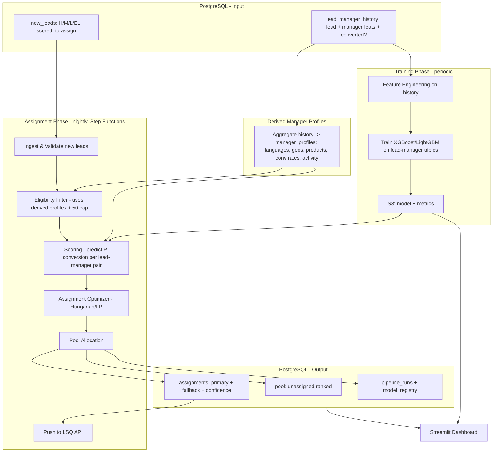

# Implementation Plan - AI-Powered Intelligent Lead Assignment Engine (Hackathon)

## Problem Statement
Build an end-to-end AWS pipeline that demonstrates intelligent lead-to-sales-manager
assignment for a hackathon. Leads arrive already scored (H/M/L/EL) by an existing
prediction model. The system trains a lead-manager conversion model on historical data,
filters eligible managers, scores each lead-manager pair, globally optimizes assignments
(capped at 50 leads per manager), routes overflow to a claimable pool, and pushes
assignments to LSQ CRM via bulk API. A Streamlit dashboard visualizes the full flow for
judges.

## Requirements
- End-to-end demo: pre-classified leads -> eligibility filter -> scoring model -> assignment optimizer -> LSQ push
- Max 50 leads per sales manager (nightly auto-assignment); remaining leads go to a claimable pool
- Assignment optimizes for conversion probability using an ML model trained on lead-manager history
- Fair workload distribution + priority for H (high intent) leads
- Streamlit dashboard showing pipeline flow, model insights, manager profiles, assignments, pool, and explainability
- Runs on AWS (no access to prod data systems - Snowflake/Airbyte); AWS credits available
- Python preferred; Terraform for IaC
- LSQ bulk API push (mock endpoint or sandbox for hackathon; same Lambda pattern as existing prod)

## Background / Context
- **Production (existing, NOT used in hackathon):** LSQ -> Airbyte -> Snowflake -> HML prediction model -> Lambda -> LSQ bulk API
- **Hackathon:** self-contained AWS pipeline, no prod data access, only AWS platform
- 600+ sales managers with overlapping coverage
- The HML classification model is built separately by the team; leads arrive already tagged H/M/L/EL. Do NOT rebuild classification.
- **Dataset is lead-manager level history**: (lead, manager, converted?) triples with both lead features and manager identifiers. This is the training data AND the single source of manager information.
- **There is NO separate managers table.** All manager attributes (languages, geographies, products handled, conversion rates, response times, activity) must be DERIVED from `lead_manager_history`.
- Model training happens INSIDE the pipeline (train on historical triples, then use trained model for scoring).
- Data layer is **PostgreSQL (RDS or Aurora Serverless v2)** - chosen for debuggability. Input data and all outputs live in Postgres. Streamlit connects directly to Postgres.

## ML Pipeline Logic (from team)
1. Lead comes in (already scored H/M/L/EL)
2. Eligibility Filter: remove reps who are over capacity, unavailable, wrong language, wrong geography
3. Scoring Model (XGBoost/LightGBM): Score(lead_i, rep_j) = P(conversion | lead+rep features), trained on historical (lead, rep, converted?) triples
4. Assignment Optimizer: Greedy top-scored rep OR Hungarian Algorithm / Linear Programming to maximize total conversion score subject to workload constraints
5. Output: Assigned rep + confidence score + fallback rep (if primary declines)

## Architecture

## Task Breakdown

### Task 1: Project scaffolding and AWS infrastructure setup (Terraform)
- Objective: Set up repo structure and Terraform config for all AWS resources.
- Implementation: Terraform (not CDK/SAM). Resources: RDS Postgres (or Aurora Serverless v2), VPC with private subnets + security groups for RDS, Lambda functions with layers (DB connection, ML libs: XGBoost/LightGBM, pandas, scipy), S3 bucket for model artifacts, Step Functions state machine, EventBridge schedule, IAM roles. Training compute: SageMaker Training Job or Fargate task for real data volume (Lambda if small). Folder structure: `/terraform`, `/lambdas/*` (ingest, eligibility, scoring, optimizer, pool, lsq_push), `/training`, `/shared`, `/dashboard`, `/db_migrations`, `/tests`. Also create `PLAN.md` at repo root with this plan.
- Test: `terraform validate` and `terraform plan` pass. Apply to a dev workspace. Verify Postgres reachable from Lambda and S3 bucket created.
- Demo: Infrastructure live, Step Function visible in AWS console, `PLAN.md` in repo.

### Task 2: Database schema and sample data loading
- Objective: Design schema centered on lead-manager history (single source of truth for manager info) plus new leads and pipeline outputs.
- Tables:
  - `lead_manager_history` (id, lead_id, manager_id, lead_intent_bucket, lead_geography, lead_language, lead_product, lead_source, lead_grade, contact_attempts, first_response_mins, converted (target), interaction_date)
  - `new_leads` (lead_id, intent_bucket, geography, language, product_interest, lead_source, grade, parent_student, created_at, batch_id)
  - `manager_profiles` (derived) (manager_id, languages_handled[], geographies_handled[], products_handled[], conv_rate_overall, conv_rate_H, conv_rate_M, conv_rate_L, avg_response_mins, total_leads_handled, last_active_date, derived_active_flag)
  - `model_registry` (model_id, trained_at, s3_path, auc, precision, recall, feature_list, training_rows, is_active)
  - `eligibility_matrix` (run_id, lead_id, manager_id, eligible, rejection_reason)
  - `scores` (run_id, lead_id, manager_id, conversion_probability)
  - `assignments` (id, run_id, lead_id, primary_manager_id, fallback_manager_id, confidence_score, match_score, assigned_at, push_status)
  - `pool` (id, run_id, lead_id, intent_bucket, priority_rank, status, claimed_by, claimed_at)
  - `pipeline_runs` (run_id, started_at, completed_at, status, leads_processed, leads_assigned, leads_pooled, errors)

### Task 3: Derived manager profiles + feature engineering module
- Aggregation from `lead_manager_history` into `manager_profiles`. Shared feature engineering module used by BOTH training and inference (avoid train/serve skew).

### Task 4: Model training job (XGBoost/LightGBM)
- Train conversion model on lead-manager triples, metrics (AUC/precision/recall), handle class imbalance, save to S3, register in `model_registry`.

### Task 5: Eligibility Filter Lambda
- Filter managers per lead using derived profiles + 50 cap. Write `eligibility_matrix` with rejection reasons. No-eligible-manager -> pool.

### Task 6: Scoring Lambda (inference)
- Load active model, apply shared feature engineering, predict P(conversion) per eligible pair, write `scores`.

### Task 7: Assignment Optimizer Lambda (Hungarian/LP)
- Global optimization with constraints (<=50/rep, H prioritized), fallback rep, confidence = primary - fallback, write `assignments`.

### Task 8: Pool allocation
- Overflow leads -> ranked claimable pool (H>M>L>EL then score). Claim updates status + capacity.

### Task 9: Step Functions orchestration
- State machine: Build Manager Profiles -> Ingest -> Eligibility -> Scoring -> Optimizer -> Pool -> LSQ Push. EventBridge nightly (assignment) + weekly (training). Log to `pipeline_runs`.

### Task 10: LSQ bulk API push Lambda
- Read assignments, format per LSQ bulk API, mock/sandbox endpoint, update `push_status`, abstracted for prod swap.

### Task 11: Streamlit dashboard
- Pages: Pipeline Flow, Model, Manager Profiles, Assignments, Pool, Explainability, Run History. Connects directly to Postgres.

### Task 12: End-to-end integration test and demo prep
- Full run build->train->assign->push, verify all tables, dashboard, demo script + prod-mapping.

## Key Notes for Execution
- Use Terraform for all IaC.
- PostgreSQL is the data layer (input + output); Streamlit connects directly to it.
- No separate managers table - derive all manager info from `lead_manager_history`.
- Leads arrive pre-classified (H/M/L/EL) - do NOT build classification.
- Model training is IN the pipeline, trained on lead-manager triples.
- LSQ push uses a mock/sandbox endpoint for the hackathon, abstracted for easy prod swap.
- Sample dataset will be provided by the user's team; build loaders that accept it.
- Security: RDS in private subnets, not publicly exposed. LSQ API credentials in AWS Secrets Manager, not hardcoded.
